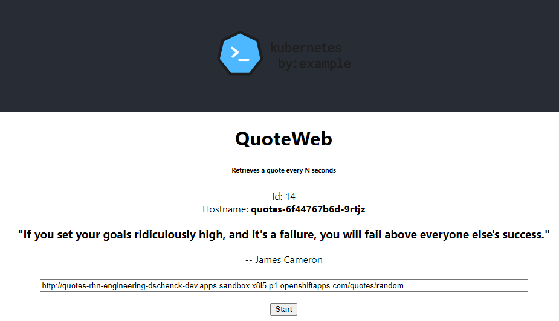

# Quotesweb  
This project is part of the Red Hat Developer Sandbox Activity entitled ["Learn Kubernetes using the Developer Sandbox for Red Hat OpenShift"](https://developers.redhat.com/developer-sandbox/activities/learn-kubernetes-using-red-hat-developer-sandbox-openshift).  

## Overview  

This application is written with ReactJS.  

This web site is one page and displays a random quote every five seconds. You will need to supply the URI to the backend service and then click the "Start" button to begin. The following image has an example URI.

The backend service URI comes from the prerequisite project "quotes", which can be found here:  
https://github.com/redhat-developer-demos/qotd-python.git  

## Associated Linux Container Image  
[quay.io/rhdevelopers/quotesweb:v1](https://quay.io/repository/donschenck/quotesweb)  

## Running in a Kubernetes cluster  
`kubectl create -f quotesweb-deployment.yaml`  
`kubectl create -f quotesweb-service.yaml`  
`kubectl create -f quotesweb-route.yaml` 

## Removing from a Kubernetes cluster  
`oc delete -l learn-kubernetes=quotesweb`  
